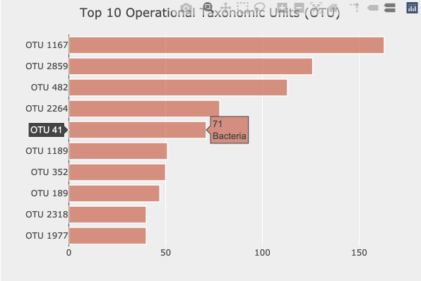
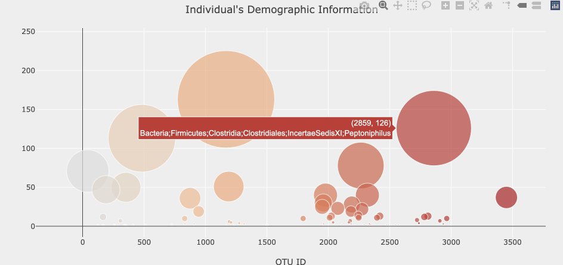
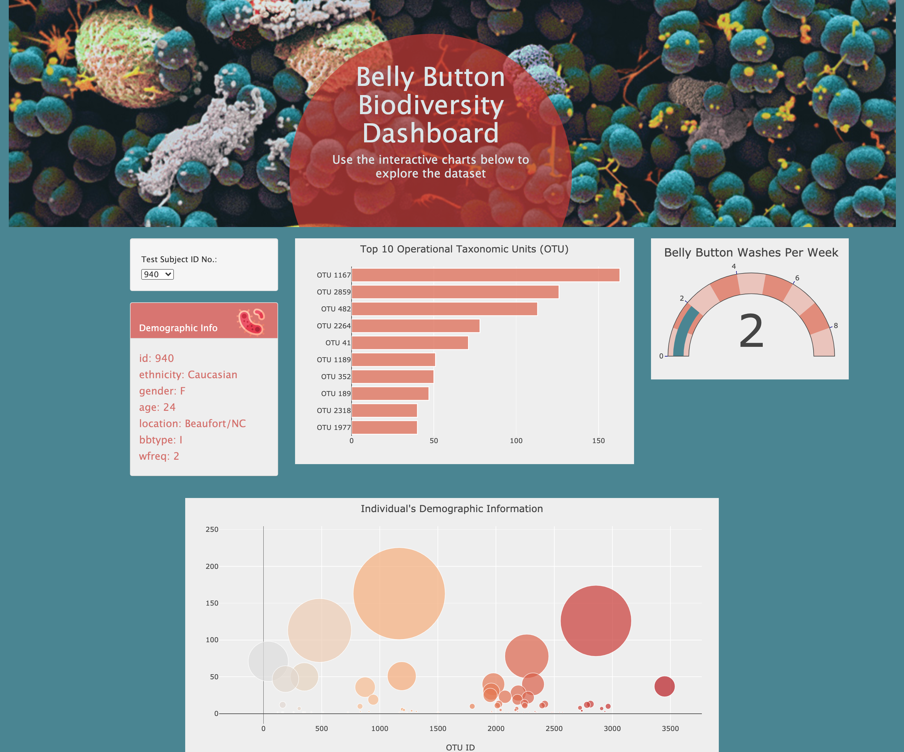

## Plot.ly---Belly-Button-Biodiversity 

***Objectives***

Using Plotly, JavaScript, HTML, JSON and CSS, I built an interactive dashboard to explore the [Belly Button Biodiversity dataset](http://robdunnlab.com/projects/belly-button-biodiversity/), which catalogs the microbes that colonize human navels.

The dataset reveals that a small handful of microbial species (also called operational taxonomic units, or OTUs, in the study) were present in more than 70% of people, while the rest were relatively rare.

#### My To Do's consisted of :
1. Using a D3 library to read the [`samples.json`](https://github.com/Kpearson72/Plot.ly---Belly-Button-Biodiversity/blob/main/data/samples.json)  
2. Creating a horizontal bar chart with a dropdown menu to display the top 10 OTUs found in that individual.
3. Creating a bubble chart that displays each sample.
4. Displaying the sample metadata, i.e., an individual's demographic information.
5. Displaying each key-value pair from the metadata JSON object somewhere on the page.
6. Updating all of the plots any time that a new sample is selected.

Here's the JavaScript code I used to build the charts and bind the data in the index.html - [`app.js`](https://github.com/Kpearson72/Plot.ly---Belly-Button-Biodiversity/blob/main/static/js/app.js)

This is the [`index.html`](https://github.com/Kpearson72/Plot.ly---Belly-Button-Biodiversity/blob/main/index.html) that was written from a Starter Code and then updated to include graphics and a design layout.

Lastly, for design elements, I included a [`style.css`](https://github.com/Kpearson72/Plot.ly---Belly-Button-Biodiversity/tree/main/static/css) to help with styling text, body color, responsive capabilities, images...etc.

## Dashboard

**Below, is a horizontal bar chart that displays the top 10 OTUs found in that individual.**

 

**Here's the bubble chart that displays each sample.**

#### Visit the [Dashboard!](https://kpearson72.github.io/Belly-Button-Biodiversity-Dashboard/) 

### About the Data

Hulcr, J. et al.(2012) _A Jungle in There: Bacteria in Belly Buttons are Highly Diverse, but Predictable_. Retrieved from: [http://robdunnlab.com/projects/belly-button-biodiversity/results-and-data/](http://robdunnlab.com/projects/belly-button-biodiversity/results-and-data/)
